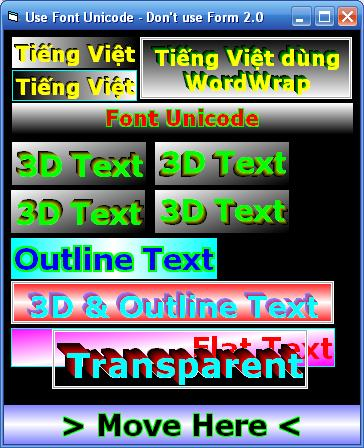



## A 3D Label

### Description

A 3D Label, support unicode without form 2.0, outline text, shadow,.. see screen shot!
 
### More Info
 

             |
---                |---
**Submitted On**   |2002-01-13 17:05:36
**By**             |[Van Hieu](https://github.com/Planet-Source-Code/PSCIndex/blob/master/ByAuthor/van-hieu.md)
**Level**          |Intermediate
**User Rating**    |5.0 (15 globes from 3 users)
**Compatibility**  |VB 5\.0, VB 6\.0
**Category**       |[OLE/ COM/ DCOM/ Active\-X](https://github.com/Planet-Source-Code/PSCIndex/blob/master/ByCategory/ole-com-dcom-active-x__1-29.md)
**World**          |[Visual Basic](https://github.com/Planet-Source-Code/PSCIndex/blob/master/ByWorld/visual-basic.md)
**Archive File**   |[A\_3D\_Label197093272006\.zip](https://github.com/Planet-Source-Code/van-hieu-a-3d-label__1-64258/archive/master.zip)

